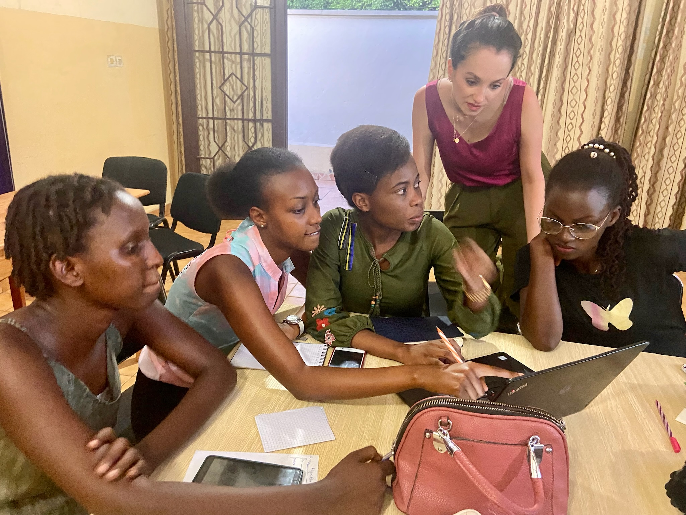

# Adaption Kirundi SFT Starter

[](https://www.python.org/downloads/)
[]()
[]()

An open-source starter repo for improving low-resource Kirundi SFT data with [Adaption](https://adaptionlabs.ai/) and comparing post-training outcomes.

> If we improve low-resource SFT data before training, do we see measurable changes in model behavior?

## Why This Project Exists

In 2023, I taught AI in Burundi and saw the AI gap up close. At the time, many of the most widely used LLM tools were not accessible from the country. But the gap was bigger than platform access alone. It was also a language gap, a data gap, and a design gap.

Many AI workflows assume abundant English data, large evaluation sets, and easy access to native-language reviewers. That is not the reality for many low-resource languages. For communities whose languages are underrepresented in training data, AI often does not meet people where they are.

This repo explores one practical slice of that problem: can adaptive data improvement make a Kirundi SFT workflow easier to build, test, compare, and improve?

The broader question is even more important: what would it look like for AI systems to adapt to the world, instead of expecting the world to adapt to them?

The framing is intentionally cautious. Qualitative model outputs are only early signals. Native speaker review matters. This repo does not claim to solve low-resource language AI. Instead, it offers a clear starter workflow that developers, researchers, and product teams can extend responsibly.

<table>
  <tr>
    <td align="center" width="50%">
      
      <br>
      <sub>Teaching AI in Burundi in 2023.</sub>
    </td>
    <td align="center" width="50%">
      
      <br>
      <sub>At the time, some major LLM tools were not available in the country.</sub>
    </td>
  </tr>
</table>

## What This Repo Builds

This repo walks through a small SFT experiment in five notebooks:

1. [`Notebook 01`](notebooks/01_prepare_kirundi_sft_dataset.ipynb): load a small subset of [`ptrdvn/kakugo-run`](https://huggingface.co/datasets/ptrdvn/kakugo-run), normalize prompt/response columns, and create the raw SFT file.
2. [`Notebook 02`](notebooks/02_adapt_dataset_with_adaption.ipynb): upload the raw data to Adaption, inspect API-visible metadata, run the adaptation job, and convert the adapted output to SFT format.
3. [`Notebook 03`](notebooks/03_sft_without_adaption.ipynb): fine-tune the base model on the raw SFT data.
4. [`Notebook 04`](notebooks/04_sft_with_adaption.ipynb): fine-tune the same base model on the Adaption-improved SFT data.
5. [`Notebook 05`](notebooks/05_compare_results_three.ipynb): compare the base model, raw-data SFT model, and adapted-data SFT model on the same short Kirundi prompts.


## Experiment Design

| Condition | Training data | Purpose |
|---|---|---|
| Base model | none | Baseline behavior before post-training |
| SFT without Adaption | cleaned raw `ptrdvn/kakugo-run` subset | Measures the effect of ordinary SFT data |
| SFT with Adaption | same subset after Adaption improvement | Measures whether data improvement changes model behavior |

The two SFT notebooks use matching training settings. The intended experimental difference is the dataset, not the model, learning rate, renderer, or sampling setup. The shared configuration lives in [`configs/project.yaml`](configs/project.yaml), with run-specific settings in [`configs/tinker_sft_raw.yaml`](configs/tinker_sft_raw.yaml) and [`configs/tinker_sft_adapted.yaml`](configs/tinker_sft_adapted.yaml).

## Dataset Notes

| Dataset | Repo ID | Used for |
|---|---|---|
| Kakugo Kirundi SFT data | [`ptrdvn/kakugo-run`](https://huggingface.co/datasets/ptrdvn/kakugo-run) | Raw SFT data for both training conditions |

Important data-quality note: `ptrdvn/kakugo-run` is used here as the Kirundi SFT source, but early inspection suggests some rows may be Kinyarwanda-like or mixed Kinyarwanda/Kirundi. This is part of the educational value of the repo: the workflow treats Adaption as a data-improvement and language-normalization step, then compares whether that changed downstream behavior. Do not assume the raw dataset is clean Kirundi without audit or native speaker review.


## Results

The saved output in [`notebooks/05_compare_results_three.ipynb`](notebooks/05_compare_results_three.ipynb) is an honest early result from a very small experiment. It does not show reliable Kirundi instruction-following yet, but it does show why improving SFT data before training is worth testing: the raw dataset is noisy, the model is sensitive to that noise, and the adapted-data condition gives a useful comparison point instead of leaving the data-quality question implicit.

What the current qualitative run shows:

| Model condition | What happened in Notebook 05 |
|---|---|
| Base model | Often echoes or translates the prompt instead of answering it. In some prompts it falls into repeated role/text loops. |
| SFT without Adaption | Produces more answer-shaped text, including lists and headings, but the content is often semantically weak, repetitive, or unrelated. |
| SFT with Adaption | Shows some encouraging task-framing signals: it often starts closer to the requested answer style and preserves relevant prompt vocabulary better than the raw-data run. It still repeats phrases, echoes prompts, and does not yet produce consistently useful Kirundi answers. |

The main takeaway is diagnostic, not conclusive. Training on around 200 examples is enough to run a proper SFT task. The Adaption version tends to start closer to the requested task and preserves more relevant vocabulary, suggesting that Adaption may already be helping with task framing or lexical alignment. The current outputs still need more data, stronger filtering, better sampling/training choices, and native speaker review.


## Setup

Create the conda environment from [`environment.yml`](environment.yml):

```bash
conda env create -f environment.yml
conda activate adaption-kirundi-sft
```

This environment uses Python 3.11, classic Jupyter Notebook 6, and RISE 5.7 for live slideshow teaching. [`environment.lock.yml`](environment.lock.yml) records the local exported environment for reproducibility, while [`requirements.txt`](requirements.txt) provides a pip-oriented dependency list.

Copy the environment example:

```bash
cp .env.example .env
```

Fill in your own credentials using the keys shown in [`.env.example`](.env.example):

```bash
HF_TOKEN=your_huggingface_token
TINKER_TOKEN=your_tinker_api_token
ADAPTION_API_KEY=your_adaption_api_key
```

## Adaption Blueprint

The Adaption data-improvement instructions live in [`configs/adaption_blueprint.yaml`](configs/adaption_blueprint.yaml). The core goal is:

> Improve this dataset for supervised fine-tuning a small assistant that can answer beginner-friendly questions in Kirundi.

The constraints emphasize preserving meaning, normalizing Kinyarwanda-like or mixed rows into Kirundi when meaning is clear, avoiding unsupported local facts, removing malformed formatting and reasoning traces, and keeping explanations simple.

This means the adapted-data condition is not only testing generic cleanup. It is also testing whether Adaption can help repair language contamination before SFT. That should be reported honestly as "data cleanup + language normalization," not as proof that the original dataset was already clean.

API usage follows the Adaption documentation:

- [Getting started](https://docs.adaptionlabs.ai/introduction/getting-started/)
- [API reference](https://docs.adaptionlabs.ai/api)
- [Processing large datasets](https://docs.adaptionlabs.ai/guides/processing-large-datasets/)
- [Reasoning traces guide](https://docs.adaptionlabs.ai/guides/reasoning-traces/)

## Limitations And Responsible Framing

- This repo is a starter workflow, not a definitive Kirundi benchmark.
- The current version focuses on qualitative comparison, not automatic benchmark metrics.
- Native speaker review is necessary before drawing strong conclusions.
- The default sample size is intentionally small for cost and iteration speed.
- Tinker and Adaption API calls require credentials and may incur usage costs.
- The base model choice is configurable. Use a model that your training provider supports and document any change.

## Evaluation: Current State and Next Step

This starter currently includes a qualitative side-by-side comparison across three model conditions: base model, SFT without Adaption, and SFT with Adaption-improved data.

Because the current run uses only ~200 SFT examples, I treat these outputs as diagnostic signals rather than final model-quality results. The early comparison helps surface whether the models are answering in the requested style, echoing prompts, repeating phrases, or producing answer-shaped but semantically weak text.

The next evaluation layer would add two proxy metrics:

1. **Language adherence:** use a language identification model to estimate the percentage of responses classified as Kirundi/Rundi.
2. **KIRNEWS classification:** evaluate whether each model can classify labeled Kirundi news examples into the correct category.

These metrics would still not replace native-speaker review, but they would give builders a more repeatable way to compare raw SFT data against Adaption-improved SFT data.

## Future Work

- Increase the dataset size and adjust hyperparameters accordingly.
- Add native-speaker review for the prompts, adapted rows, and generated answers.
- Add automatic evaluations later, once the qualitative behavior is less noisy.
- Expand this workflow to other low-resource languages with community contributors.

## Important Notice

This project is provided as-is for educational and research purposes.

- It is not production-ready.
- It may contain incomplete API examples while services evolve.

Contributions are welcome! 🇧🇮 Please feel free to submit issues or pull requests.
